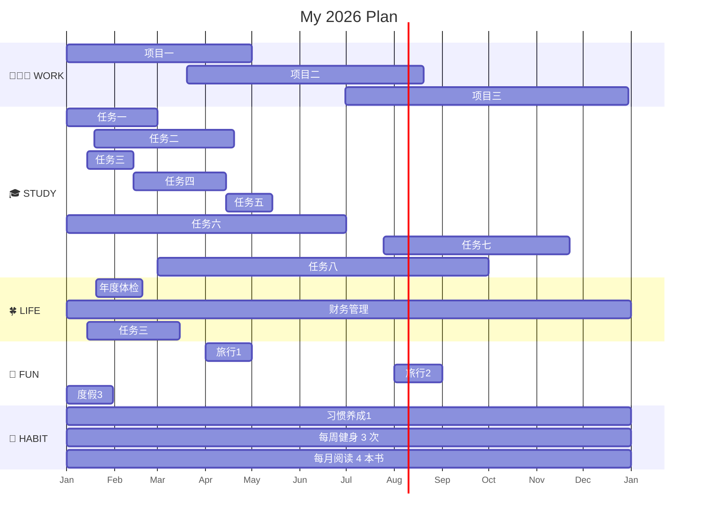

## 年度计划


## 月度任务

### **06June**

```dataviewjs
await dv.view("03Resources/00Obsidian/CSS_Scripts/habit-tracker",    
			{month: "2026-06"  
			 }
		);
````


>[!col]
>
>>[!danger]+ 👩🏻‍💻 **WORK** 
>>- **副业1**
>>	- [ ] 项目一⏳ 2026-06-02 
>>	- [ ] 项目二⏳ 2026-06-17 
>>	
>>- **主业1**
>>	- [ ] 项目一⏳ 2026-06-30
>>	- [ ] 项目二⏳ 2026-06-18 
>
>> [!note] 🎓 **STUDY**
>> -  **专业提升**
>>     - [x] 学习计划1⏳ 2026-06-01 
>>     - [ ] 学习计划2⏳ 2026-06-30
>>     - [ ] 学习计划3⏳ 2026-06-20 
>>     
>> - **兴趣学习**
>> 	- [ ] 外语学习⏳ 2026-06-30
>> 	- [ ] 学习任务2⏳ 2026-06-30

 >[!col]
>
>> [!check] ☘️ **LIFE**
>> 
>> - **健康管理**
>> 	- [ ] 健身⏳ 2026-06-30
>> 	- [ ] 跑步
>> 
>> - **财务/日常**
>> 	- [ ] 家庭支出整理⏳ 2026-06-16 
>
>> [!attention] 🎈 **FUN**
>> 
>>-  **旅行放松**
>>	- [ ] 周边游⏳ 2026-06-30
>>
>>-  **休闲娱乐**
>>	- [ ] 读完一本书⏳ 2026-06-30

### **07July**
### **08August**


## 日程总览

```dataviewjs
await dv.view("03Resources/00Obsidian/CSS_Scripts", {pages: "", view: "month", firstDayOfWeek: "1", options: "noLineClamp noFilename  noWeekNr noDailyNote style4"})
```


